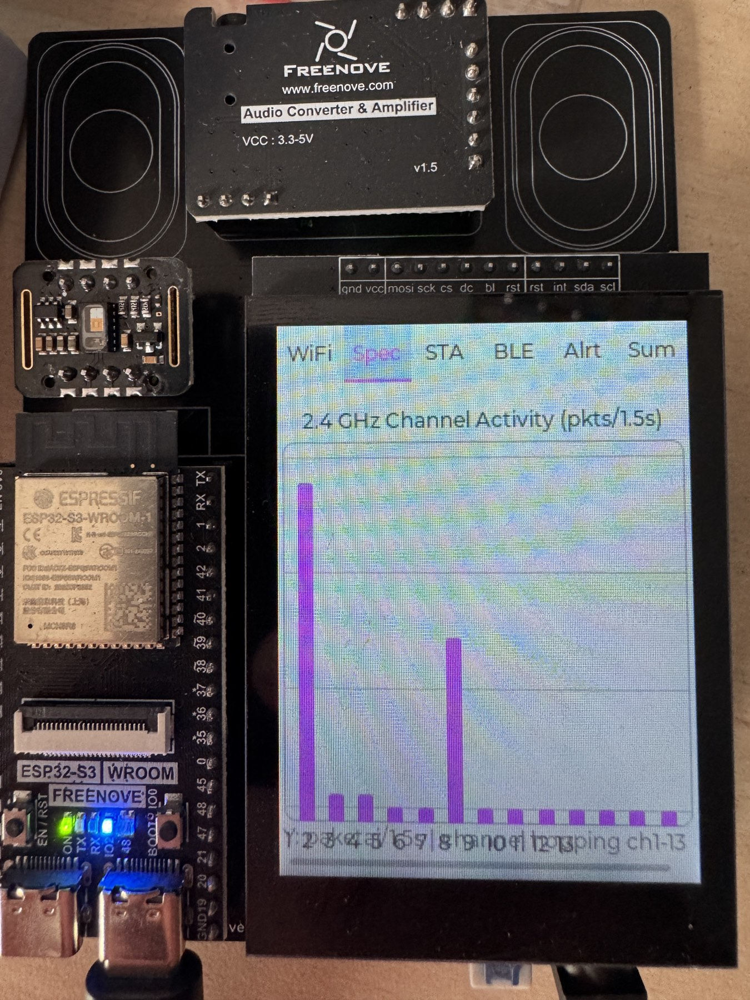
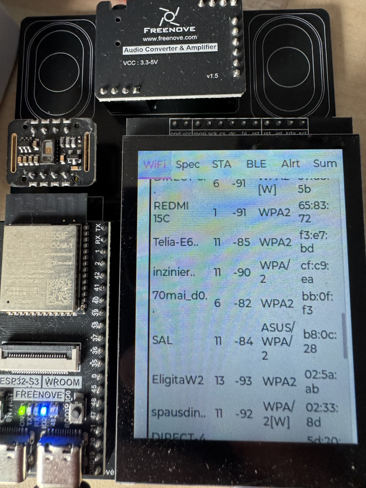
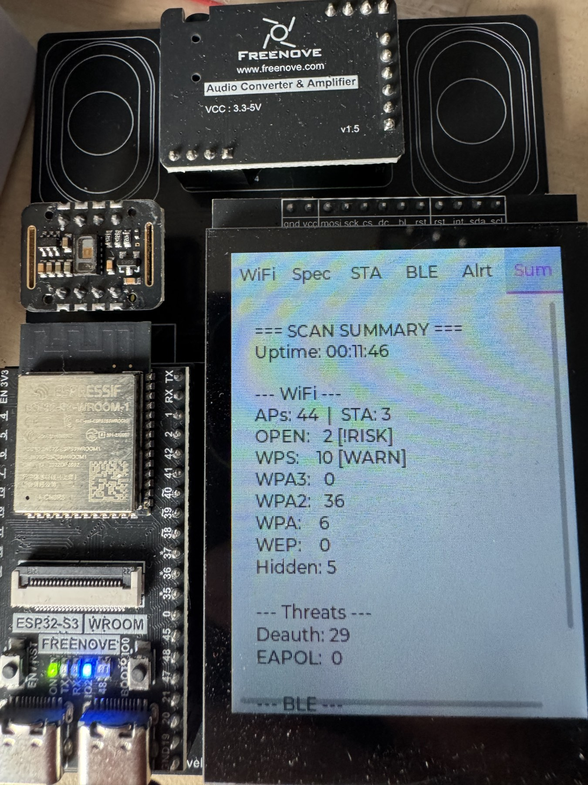

# SpectraScan

**ESP32-S3 portable wireless security auditor — WiFi & BLE scanner with touch TFT display**

<p align="center">
  
  
  
</p>

## Features

### WiFi Security Audit
- **Promiscuous mode** passive scanning (no probe requests sent)
- **Channel hopping** across 1–13 channels with spectrum analyzer
- **Encryption detection** — WPA3/WPA2/WPA/WEP/OPEN from RSN/WPA IE
- **WPS detection** from Vendor Specific IE
- **Deauth/Disassoc attack detection** with real-time alerts
- **EAPOL 4-way handshake capture** + PMKID extraction (hashcat -m 22000 format)
- **Station (client) tracking** from data frame DS bits
- **Open network alerts** — automatic warning for unencrypted APs

### BLE Security Scan
- **AirTag detection** (Apple CID 0x004C + FindMy payload)
- **Flipper Zero detection** (CID 0x0BA0)
- **BLE skimmer heuristic** — anonymous, strong signal, unknown CID
- **Auto-expire** stale devices after 60s

### User Interface
- **240×320 TFT** with capacitive touch (FT6336U)
- **6 tabs**: WiFi | Spectrum | Stations | BLE | Alerts | Summary
- **LVGL 8.4** graphics with smooth animations
- Touch navigation + serial tab control (`1`–`6`)

## Hardware

| Component | Spec |
|-----------|------|
| Board | Freenove ESP32-S3 FNK0086 |
| MCU | ESP32-S3R8 (dual-core 240 MHz, 8 MB PSRAM) |
| Display | 2.8" ST7789 240×320 TFT |
| Touch | FT6336U capacitive (I2C) |
| Wireless | WiFi 802.11 b/g/n + Bluetooth 5.0 LE |

### Pin Configuration

| Function | GPIO |
|----------|------|
| TFT Backlight | 45 |
| Touch SDA | 2 |
| Touch SCL | 1 |
| TFT SPI | HSPI (see TFT_eSPI config) |

## Getting Started

### Prerequisites

- [Arduino IDE](https://www.arduino.cc/en/software) 1.8.x or 2.x
- ESP32 Board Package **2.0.7** (`esp32` by Espressif)
- Libraries:
  - `TFT_eSPI` v2.5.43
  - `lvgl` v8.4.0
  - `Arduino-FT6336U` v1.0.2

### TFT_eSPI Configuration

In `User_Setup_Select.h`, enable the Freenove profile:
```cpp
#include <User_Setups/FNK0086A_2.8_CFG1_240x320_ST7789.h>
```

### LVGL Configuration

In `lv_conf.h`:
```cpp
#define LV_FONT_MONTSERRAT_12  1
```

### Build & Flash

1. Open `firmware/SpectraScan/SpectraScan.ino` in Arduino IDE
2. Select board: **ESP32S3 Dev Module**
3. Settings:
   - USB CDC On Boot: **Enabled**
   - Partition Scheme: **Huge APP (3MB No OTA)**
   - Flash Size: **8MB**
4. Upload

### Serial Commands

| Key | Action |
|-----|--------|
| `1`–`6` | Switch to tab 1–6 |

## Project Structure

```
SpectraScan/
├── firmware/
│   └── SpectraScan/
│       └── SpectraScan.ino    # Main firmware source
├── tools/
│   └── TouchCalibrationTest/
│       └── TouchCalibrationTest.ino  # Touch diagnostics & calibration
├── docs/                      # Photos & documentation
├── hardware/                  # Hardware reference
├── DEVELOPMENT.md             # Build workflow & dev notes
├── LICENSE                    # MIT License
├── .gitignore
└── README.md
```

## How It Works

SpectraScan operates in **fully passive mode** — it never transmits packets. It uses ESP32's promiscuous (monitor) mode to capture WiFi management and data frames, extracting:

1. **Beacon frames** → AP SSID, channel, encryption, BSSID, WPS status
2. **Data frames** → Client MAC addresses (station tracking)
3. **EAPOL frames** → WPA handshake messages + PMKID
4. **Deauth/Disassoc frames** → Attack detection with alerting

BLE scanning runs in parallel using ESP32's Bluetooth 5.0 LE with coexistence priority management.

## Legal Disclaimer

This tool is designed for **authorized security auditing only**. It operates in passive receive-only mode and does not transmit any packets. Always ensure you have proper authorization before conducting wireless security assessments. The authors are not responsible for misuse.

## Contributing

Contributions are welcome! Please open an issue or submit a pull request.

## License

This project is licensed under the MIT License — see the [LICENSE](LICENSE) file for details.
